  
  

 
  
  
  
  

## Hi there 👋 

### This is Sansegron!

I'm a computer science enthusiast who usually works on some personal projects, 

though I'm not very skilled—so please bear with me!

Currently, I mainly use languages like Python, Java, JavaScript, and Rust for my projects.
